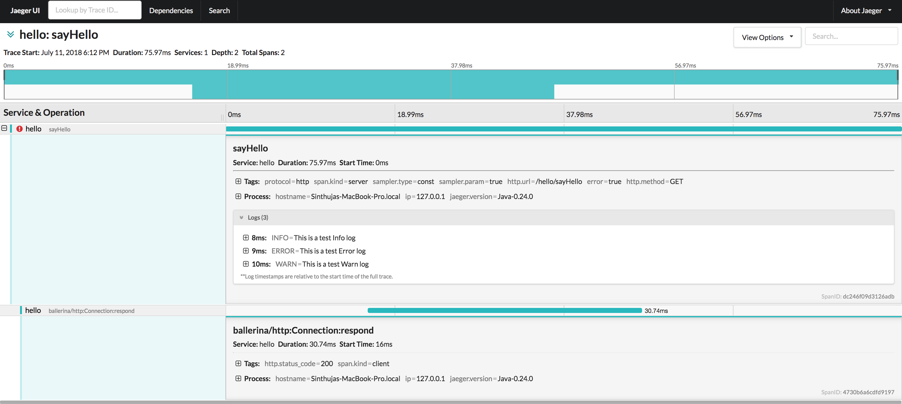
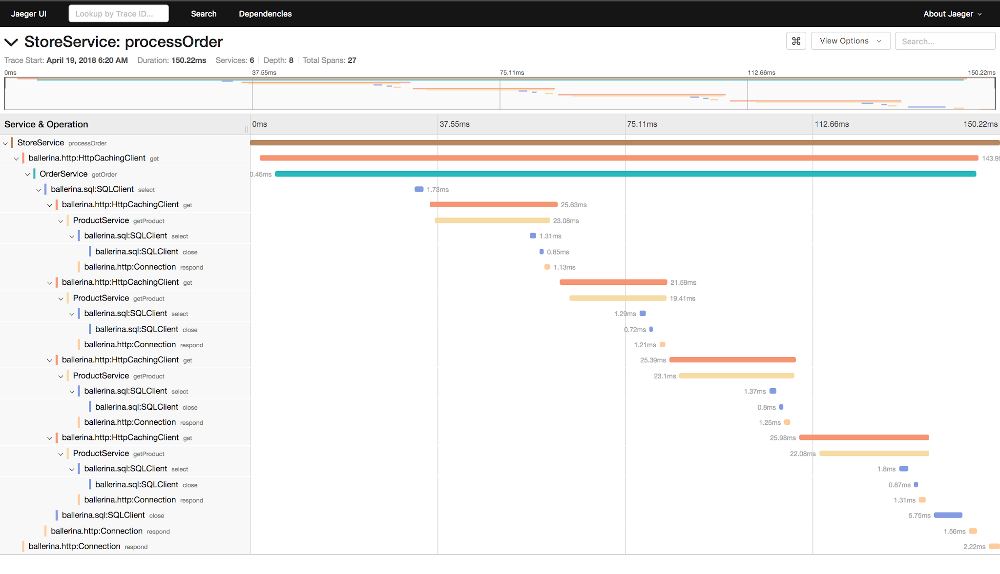
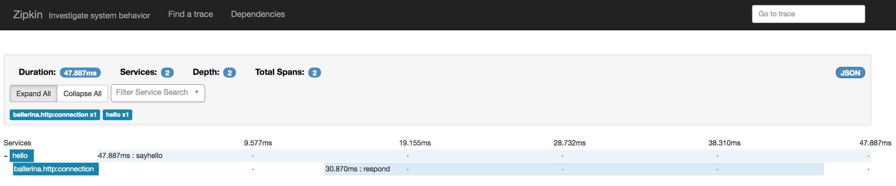

# How to Observe Ballerina Programs

## Introduction
Observability is a measure of how well internal states of a system can be inferred from knowledge of its external outputs. Monitoring, logging, and distributed tracing are key methods which reveals the internal state of the system, indeed the observability. Therefore ballerina provides default support for monitoring metrics such as request count and response time statistics, log processing and analysis, and distributed tracing according to [OpenTracing](https://github.com/opentracing/specification/blob/master/specification.md) specification, which collectively yields the full observability for ballerina services. 

Ballerina services that are using the below mentioned service/client connectors are observable by default. 
* HTTP/HTTPS
* SQL 


## Quick Start
Ballerina service is by default observable. This section focuses on enables observability with default systems with Jeager for distributed tracing, and Prometheus and Grafana for Metrics Monitoring. 

1. Create hello-world ballerina service as shown below and save the above service as `hello-world-service.bal`. 

```ballerina
import ballerina/http;

service<http:Service> hello bind { port:9090 } {
	sayHello (endpoint conn, http:Request req) {
    	http:Response res = new;
    	res.setStringPayload("Hello, World!");
    	_ = conn -> respond(res);
	}
}
```
2. The observability is disabled by default and it can be enabled by either adding inline parameter and updating the configuration.
Inline Parameter : 
Observability for ballerina service can be enabled with a short hand inline parameter --observe as shown below. This enables observability for ballerina service with default settings, and publish the distributed tracing information to [Jaeger](https://www.jaegertracing.io/) and metrics information to [Prometheus](https://prometheus.io/). 

```bash
$ ballerina run hello_service.bal --observe

ballerina: started Prometheus HTTP endpoint localhost/127.0.0.1:9797
ballerina: started publishing tracers to Jaeger on localhost:5775
ballerina: initiating service(s) in 'hello-world-service.bal'
ballerina: started HTTP/WS endpoint 0.0.0.0:9090
```
Configuration file: 
Observability can be enabled from configuration. An example configuration which starts observability with metrics monitoring and distributed tracing with default configurations is given below. 
```
[b7a.observability.tracing]
# Flag to enable Tracing
enabled=true

[b7a.observability.metrics]
# Flag to enable Metrics
enabled=true
```
The ballerina program needs to be started as below with eith --config or -c inline parameter and provide the path of the configuration file to adhere to the configuration.
```bash
$ ballerina run hello_service.bal --config <path-to-conf>/ballerina.conf

ballerina: started Prometheus HTTP endpoint localhost/127.0.0.1:9797
ballerina: started publishing tracers to Jaeger on localhost:5775
ballerina: initiating service(s) in 'hello-world-service.bal'
ballerina: started HTTP/WS endpoint 0.0.0.0:9090
```

3. Install and configure premetheus as mentioned in section [configuring prometheus](#Prometheus)/
4. Install grafana as mentioned in section [configuring grafana](#grafana)
5. Install Jaeger as mentioned in section [configuring jaeger](#jeager)
6. Send few requests to http://localhost:9090/hello/sayHello
   Example cURL command:
```
curl http://localhost:9090/hello/sayHello
```
7. Now go to imported dashboard in grafana and check the metrics. Similarly go to Jaeger dashboard at http://localhost:16686/ and check the traces. 

 
## Metrics Monitoring
Metrics help to monitor the runtime behaviour of the service. Therefore, metrics is a vital part of monitoring Ballerina or actually considered as monitoring itself. However, metrics is not the same as analytics. For example, you should not use metrics to do something like per-request billing. Metrics are used to measure what Ballerina code does in runtime to make better decisions using the numbers. The code generates business value when it is run in production. Therefore, it is imperative to continuously measure the code in production.

Metrics, by default, supports Prometheus. In order to support Prometheus, an HTTP endpoint starts with the context of `/metrics` in default port 9797 when starting the Ballerina program. 

### Configure Ballerina
This section focuses on the ballerina configurations that are available for metrics monitoring with Prometheus, and the sample configuration is provided below.

```
[b7a.observability.metrics]
enabled=true
provider="micrometer"

[b7a.observability.metrics.micrometer]
registry.name="prometheus"

[b7a.observability.metrics.prometheus]
port=9797
hostname="0.0.0.0"
descriptions=false
step="PT1M"
```

The descriptions of each configurations above is provided below with possible alternate options.

Configuration Key | Description | Default Value | Possible Values 
--- | --- | --- | --- 
b7a.observability.metrics.enabled | Whether metrics monitoring is enabled (true) or disabled (false) | false | true or false
b7a.observability.metrics.provider | Provider name which implements Metrics interface. This is only required to be modified if a a custom provider is implemented and needs to be used. | micrometer | micrometer or if any custom implementation, then name of the provider.
b7a.observability.metrics.micrometer.registry.name | Name of the registry used in micrometer | prometheus | prometheus 
b7a.observability.metrics.prometheus.port | The value of the port in which the service '/metrics' will be bind to. This service will be used by Prometheus to scrape the information of the ballerina program. | 9797 | Any suitable value for port 0 - 0 - 65535. However, within that range, ports 0 - 1023 are generally reserved for specific purposes, therefore it's advisable to select a port without that range. 
b7a.observability.metrics.prometheus.hostname | The hostname in which the service '/metrics' will be bind to. This service will be used by Prometheus to scrape the information of the ballerina program. | 0.0.0.0 | IP or Hostname or 0.0.0.0 of the node in which the ballerina program is running.
b7a.observability.metrics.prometheus.descriptions | This flag indicates whether meter descriptions should be sent to Prometheus. Turn this off to minimize the amount of data sent on each scrape. | false | true or false
b7a.observability.metrics.prometheus.step | The step size to use in computing windowed statistics like max. To get the most out of these statistics, align the step interval to be close to your scrape interval. | PT1M (1 minute) | The formats accepted are based on the ISO-8601 duration format PnDTnHnMn.nS with days considered to be exactly 24 hours.

### Configure External Systems
There are mainly two systems involved in collecting and visualizing the metrics. Prometheus is used to collect the metrics from the ballerina program and Graphana integrates with prometheus to visualize the metrics in the dashboard. 

#### Prometheus
Prometheus is used as the monitoring system, which pulls out the metrics collected from the ballerina service '/metrics'. There are many ways to install the Prometheus and you can find the possible options from [installation guide](https://prometheus.io/docs/prometheus/latest/installation/).  

This section focuses on quick installation of Prometheus with docker, and configure it to collect metrics from ballerina program with default configurations. Below provided steps needs to be followed to configure the Prometheus.

1. Create a prometheus.yml file in /tmp/ directory.
2. Use following content for /tmp/prometheus.yml. Go to [this](https://prometheus.io/docs/introduction/first_steps/), if you need more information.
   Please note the targets should contain the host and port of the '/metrics' service that's exposed from ballerina program for metrics collection. Let's say if the IP of the host in which the ballerina program is running is a.b.c.d and the port is default 9797 (configured from b7a.observability.metrics.prometheus.port configuration in ballerina configuration file), then the sample configuration in prometheus will be as below.
```
global:
  scrape_interval: 	15s
  evaluation_interval: 15s

scrape_configs:
  - job_name: 'prometheus'
	static_configs:
  	  - targets: ['a.b.c.d:9797']
```

3. Start the Prometheus server as docker container with below command.

```bash
docker run -p 19090:9090 -v /tmp/prometheus.yml:/etc/prometheus/prometheus.yml prom/prometheus
```

Once the above steps are completed, the Prometheus can be accessed from http://localhost:19090/ from where the docker is running. 

#### Grafana
Let’s use Grafana to visualize metrics in dashboard. For this, we need to install Grafana, and and the Prometheus as a datasource to fetch the data from. Follow the below provided steps and configure Grafana. 

1. Start Grafana as docker container with below command. For more information, please go to [link](https://hub.docker.com/r/grafana/grafana/).
```bash
docker run -d --name=grafana -p 3000:3000 grafana/grafana
```
2. Go to http://localhost:3000/ from where the docker is running, and access the Grafana dashboard. 
3. Login to the dashboard with default user, username: admin and password: admin
4. Add prometheus as datasource with direct access configuration as provided below. 

5. Now you can import the default grafana dashboard which has some default graphs to visualize the request/response metrics. 


## Distributed Tracing

Tracing provides information regarding the roundtrip of a service invocation based on the concept of spans, which are structured in a hierarchy based on the cause and effect concept. Tracers propagate across several services which can be deployed in several nodes, depicting a high level view of interconnections among services as well, hence coining the term distributed tracing.

A span is a logical unit of work, which encapsulates a start and end time as well as metadata to give more meaning to the unit of work being completed. For example a span representing a client call to an HTTP endpoint would give the user the latency of the client call and metadata like the HTTP URL being called and HTTP method used. If the span represents an SQL client call, the metadata would include the query being executed.

Tracing gives the user a high-level view of how a single service invocation is processed across several distributed microservices. 

* Identify service bottlenecks - The user can monitor the latency’s and identify when a service invocation slows down, pinpoint where the slowing down happens (by looking at the span latency’s) and take action to improve the latency.
* Error identification - If an error occurs during the service invocation, it will show up in the list of tracers. The user can easily identify where the error occurred and information of the error will be attached to the relevant span as metadata.

Ballerina supports [OpenTracing](http://opentracing.io/) standards out of the box. This means that Ballerina services can be traced using OpenTracing implementations like [Jaeger](http://www.jaegertracing.io/), and [Zipkin](https://zipkin.io/). Jaeger is the default tracer of Ballerina.

### Configure Ballerina
Tracing can be enabled in ballerina with inline parameter --observe as mentioned in the Quick Start section, as well as configuration option. This section mainly focuses on the configuration option with description and possible values. 

The sample configuration which enables tracing, and uses jaeger as the sample tracer as provided below. 
```
[b7a.observability.tracing]
enabled=true
name="jaeger"
```
The below table provides the descriptions of each configuration options and possible values that can be assigned. 

Configuration Key | Description | Default Value | Possible Values 
--- | --- | --- | --- 
b7a.observability.tracing.enabled | Whether tracing is enabled (true) or disabled (false) | false | true or false
b7a.observability.tracing.name | Tracer name which implements tracer interface. | jaeger | jaeger or zipkin

#### Jaeger
Jaeger is the default tracer supported by Ballerina. Below is the sample configuration options that are available in the Jaeger.
```
[b7a.observability.tracing]
enabled=true
name="jaeger"

[b7a.observability.tracing.jaeger]
reporter.hostname="localhost"
reporter.port=5775
sampler.type="const"
sampler.param=1.0
reporter.flush.interval.ms=2000
reporter.max.buffer.spans=1000
```

The below table provides the descriptions of each configuration options and possible values that can be assigned. 

Configuration Key | Description | Default Value | Possible Values 
--- | --- | --- | --- 
b7a.observability.tracing.jaeger.reporter.hostname | Hostname of the Jaeger server | localhost | IP or hostname of the Jaeger server. If it's running on the same node as ballerina, it can be localhost. 
b7a.observability.tracing.jaeger.reporter.port | Port of the Jaeger server | 5775 | The port which the Jaeger server is listening to.
b7a.observability.tracing.jaeger.sampler.type | Type of the sampling methods used in the Jaeger tracer. | const | const, probabilistic, or ratelimiting.
b7a.observability.tracing.jaeger.sampler.param | It's a floating value. Based on the sampler type, the effect of the sampler param varies. Const - 0 is no sampling and 1 is sample all spans, Probabilistic - must be between 1.0 and 0.0, and Ratelimiting - param specifies rate per second | 1.0 | 0.0 - 1.0
b7a.observability.tracing.jaeger.reporter.flush.interval.ms | Jaeger client will be sending the spans to the server at this interval. | 2000 | Any positive integer value.
b7a.observability.tracing.jaeger.reporter.max.buffer.spans | Queue size of the Jaeger client. | 2000 | Any positive integer value. 

#### Zipkin
The tracing of ballerina program can be done via zipkin as well, but the required dependencies are not included in default ballerina distribution. Follow the below steps to add the required dependencies to the ballerina distribution.

1. Go to [ballerina-observability](https://github.com/ballerina-platform/ballerina-observability) and clone the github repository in any preferred location.
2. Make sure you have installed [apache maven](http://maven.apache.org/).
3. Open command prompt and build the repository by using [apache maven](http://maven.apache.org/) with below command while being in the root project directory ballerina-observability.
```    
$ maven clean install
```
4. Go to path - ballerina-observability/tracing-extensions/modules/ballerina-zipkin-extension/target/distribution.zip and extract it.
5. Copy all the jars that exists in distribution.zip to 'bre/lib' directory in the ballerina distribution. 
6. Change below configuration name to zipkin, therefore all tracers will be sent to zipkin instead of default tracer jeager. 
```
[b7a.observability.tracing]
name="zipkin"
```
7. The below provided configuration is the sample configuration options available for zipkin tracer. 
```
[b7a.observability.tracing.zipkin]
reporter.hostname="localhost"
reporter.port=9411
```

The below table provides the descriptions of each configuration options and possible values that can be assigned. 

Configuration Key | Description | Default Value | Possible Values 
--- | --- | --- | --- 
b7a.observability.tracing.zipkin.reporter.hostname | Hostname of the Zipkin server | localhost | IP or hostname of the Zipkin server. If it's running on the same node as ballerina, it can be localhost. 
b7a.observability.tracing.zipkin.reporter.port | Port of the Zipkin server | 9411 | The port which the Zipkin server is listening to.

### Configure External Systems
Ballerina by default supports Jaerger and Zipkin for distributed tracing. This section focuses on configuring the jaeger and zipkin with dockers as a quick installation.

#### Jaeger
Jeager is the default distributed tracing system that is supported. There are many possible ways to deploy Jaeger and you can find more information on this [link](https://www.jaegertracing.io/docs/deployment/). Here we focus on all in one deployment with docker.

1. Install Jaeger via docker and start the docker container by executing below command. 
```bash
docker run -d -p5775:5775/udp -p6831:6831/udp -p6832:6832/udp -p5778:5778 -p16686:16686 -p14268:14268 jaegertracing/all-in-one:latest
```
2. Go to http://localhost:16686 and load the web UI of the jaeger to make sure it's functioning properly. The below image is the sample tracing infomration you can see from Jaeger. 


#### Zipkin
Similar to jaeger, zipkin is another distributed tracing system that is supported by ballerina. There are many different configurations and deployment exists for zipkin, please go to [link](https://github.com/openzipkin/zipkin) for more information. Here we docus on all in one deployment with docker. 

1. Install Zipkin via docker and start the docker container by executing below command.
```bash
docker run -d -p 9411:9411 openzipkin/zipkin
```
2. Go to http://localhost:9411/zipkin/ and load the web UI of the zipkin to make sure it's functioning properly. The below shown is the sample zipkin dashboard for the hello-world sample in the [Quick Start](#Quick-start)


