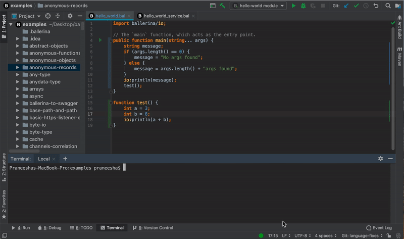

# Using the IntelliJ plugin features

Click on the below links to find information on the various capabilities that are fascilitated by the IntelliJ Ballerina plugin for the development process.

- [Running Ballerina programs](#running-ballerina-programs)
- [Debugging Ballerina programs](#debugging-ballerina-programs)
- [Importing modules on the fly](#importing-modules-on-the-fly)
- [Importing unambiguous modules automatically](#importing-unambiguous-modules-automatically)
- [Finding usage](#finding-usage)
- [Formatting Ballerina codes](#formatting-ballerina-codes)
- [Viewing details of parameters](viewing-details-of-parametyers)
- [Viewing documentation](#viewing-documentation)
- [Adding annotation fields via suggestions](#adding-annotation-fields-via-suggestions)
- [Using file templates](#using-file-templates)
- [Using code snippet templates](#using-code-snippet-templates)
- [Checking spellings](#checking-spellings)
- [Analyzing semantics](#analyzing-semantics)

## Running Ballerina programs

You can run Ballerina main/service programs with a single click without adding or changing any configurations.

> **Tip:** For more information, see [Running Ballerina files](#using-the-intellij-plugin.md)

## Debugging Ballerina programs

You can debug Ballerina main/service programs with a few clicks.

## Importing modules on the fly

You can add import declarations to your Ballerina programs on the fly. When you select the module name from the lookup list, the module declaration will be added automatically.

## Importing unambiguous modules automatically

When you copy and paste Ballerina code to the Editor, this feature allows you to import unambiguous imports automatically. You can apply these imports by clicking on the module name and pressing **Alt + Enter** keys.

>**Note:** This is disabled by default since this might cause issues if the file contains grammar mistakes. Follow the steps below to enable it.
>1. Open the editor, click **IntelliJ IDEA** in the top menu, click **Preferences**, and then click **Languages and Frameworks**. 
>- **Tip:** If you are using Windows, click **File**, click **Settings**, and then click **Languages and Frameworks**.
>2. Click **Ballerina** and then click **Auto Import**.
>3. Select the **Add unambiguous imports on the fly** checkbox and click **OK**.

## Finding usage

You can use the plugin to find the usage of variables, functions, etc.

## Viewing definitions

You can view the definition of variables, function invocations, etc. by pressing the **Ctrl** key whicle clicking on them.

## Formatting Ballerina codes

You can reformat the Ballerina codes by pressing the **Ctrl+Alt+L** keys.

## Viewing details of parameters

You can view the required parameters of a function, remote function, etc. by pressing the **Ctrl+P** keys.

## Viewing documentation

You can view the documentation of a function, remote function, etc. by pressing the **Ctrl+Q** keys or by hovering over the element while pressing the **Ctrl** key.

## Adding annotation fields via suggestions

You can add annothation fields to your code uisng the annotation field names that are suggested inside annotation attachments.

## Using file templates

Three types of Ballerina file templates are available.

1. **Ballerina Main** - contains a sample main program
2. **Ballerina Service** - contains a sample service
3. **Empty File** - contains an empty file

## Using code snippet templates

Code snippet templates contain boilerplate codes and allows you to write your code efficiently. 

## Checking spellings

The spell-checker is enabled for all identifiers. You can rename all of the definitions and references as well.

## Analyzing semantics

The Ballerina IDEA plugin provides capabilities to diagnose and analyze semantics of your Ballerina programs through the Ballerina Language Server.

>**Note:** This feature is disabled by default due to as it might affect the performance of the IDE. 

Follow the steps below to enable it.

1. Open the editor, click **IntelliJ IDEA** in the top menu, click **Preferences**, and then click **Languages and Frameworks**. 
>**Tip:** If you are using Windows, click **File**, click **Settings**, and then click **anguages and Frameworks**.
2. Click **Live Templates**, select **Ballerina**, and then click **Semantic Analyzer**.

## Code folding

You expand/collapse the following Ballerina code segments using the icons in the editor.

- imports
- services 
- objects
- records
- functions and object functions
- annotations
- markdown documentation
- multiline comments
 

